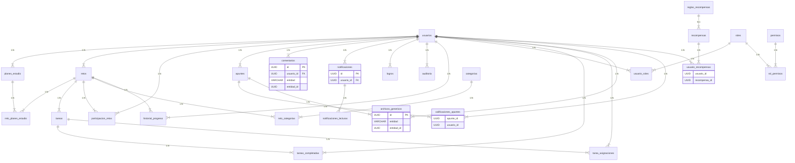

# Challenge Plans - Plataforma de Aprendizaje Colaborativo

  


  

**Nombre:** Jose Luis Obiang Ela Nanguang  

**Profesor:** Enrique Moguel  

**Asignatura:** Plataformas, Frameworks y Tendencias Tecnológicas.  

**Fecha entrega:** 14/03/2025  

➡️[Github](https://github.com/Jloen1999/challenge_Plans.git)

---

## 📋 Índice

- [Challenge Plans - Plataforma de Aprendizaje Colaborativo](#challenge-plans---plataforma-de-aprendizaje-colaborativo)
  - [📋 Índice](#-índice)
  - [Introducción](#introducción)
    - [Tecnologías Principales](#tecnologías-principales)
      - [Backend](#backend)
      - [Frontend](#frontend)
  - [Estructura del Proyecto](#estructura-del-proyecto)
    - [Backend](#backend-1)
    - [Frontend](#frontend-1)
  - [Configuración del Entorno](#configuración-del-entorno)
    - [Prerrequisitos](#prerrequisitos)
    - [Instalación](#instalación)
  - [Configuración de la Base de Datos](#configuración-de-la-base-de-datos)
    - [Modelo de Base de Datos](#modelo-de-base-de-datos)
      - [Diagrama](#diagrama)
      - [Entidades Principales](#entidades-principales)
      - [Entidades de Relación](#entidades-de-relación)
      - [Entidades de Soporte](#entidades-de-soporte)
    - [Optimizaciones de Base de Datos](#optimizaciones-de-base-de-datos)
      - [Índices](#índices)
      - [Triggers y Funciones Automatizadas](#triggers-y-funciones-automatizadas)
        - [1. Actualización automática de nivel de usuario](#1-actualización-automática-de-nivel-de-usuario)
        - [2. Gestión de tareas completadas](#2-gestión-de-tareas-completadas)
        - [3. Actualización automática de progreso en retos](#3-actualización-automática-de-progreso-en-retos)
        - [4. Sistema de notificaciones automáticas](#4-sistema-de-notificaciones-automáticas)
    - [Vistas Materializadas](#vistas-materializadas)
    - [Sistema de Gamificación](#sistema-de-gamificación)
    - [Variables de Entorno](#variables-de-entorno)
    - [Verificación de Conexión](#verificación-de-conexión)
    - [🔄 Sistema de Migraciones](#-sistema-de-migraciones)
      - [Componentes Principales](#componentes-principales)
      - [Estrategias de Ejecución](#estrategias-de-ejecución)
        - [1️⃣ Ejecución Automática (todas las migraciones)](#1️⃣-ejecución-automática-todas-las-migraciones)
        - [2️⃣ Ejecución Manual Controlada (Recomendada)](#2️⃣-ejecución-manual-controlada-recomendada)
      - [🔍 Verificación del Esquema](#-verificación-del-esquema)
      - [🔙 Revertir una Migración](#-revertir-una-migración)
      - [Flujo de Trabajo Recomendado](#flujo-de-trabajo-recomendado)
  - [Servicios del Backend](#servicios-del-backend)
    - [Servicios de Usuario y Autenticación](#servicios-de-usuario-y-autenticación)
    - [Servicios de Contenido Educativo](#servicios-de-contenido-educativo)
    - [Servicios de Interacción y Colaboración](#servicios-de-interacción-y-colaboración)
    - [Servicios de Soporte y Gestión](#servicios-de-soporte-y-gestión)
  - [Controladores y Rutas](#controladores-y-rutas)
    - [Controladores Principales](#controladores-principales)
      - [Ejemplo de Controlador de Retos](#ejemplo-de-controlador-de-retos)
    - [Definición de Rutas API](#definición-de-rutas-api)
      - [Estructura de Rutas Principal](#estructura-de-rutas-principal)
    - [Tabla de Endpoints API](#tabla-de-endpoints-api)
      - [Autenticación y Usuarios](#autenticación-y-usuarios)
      - [Retos y Tareas](#retos-y-tareas)
      - [Planes de Estudio](#planes-de-estudio)
      - [Apuntes y Recursos](#apuntes-y-recursos)
      - [Interacción Social y Comentarios](#interacción-social-y-comentarios)
      - [Categorías y Taxonomía](#categorías-y-taxonomía)
  - [Manual de Uso de Express](#manual-de-uso-de-express)
  - [Funcionalidades del Frontend](#funcionalidades-del-frontend)
    - [Sistema de Autenticación](#sistema-de-autenticación)
    - [Dashboard Interactivo](#dashboard-interactivo)
    - [Gestión de Retos](#gestión-de-retos)
    - [Planes de Estudio Personalizados](#planes-de-estudio-personalizados)
    - [Sistema de Apuntes](#sistema-de-apuntes)
    - [Componentes Reutilizables](#componentes-reutilizables)
    - [Animaciones y Transiciones](#animaciones-y-transiciones)
    - [Tema Personalizable](#tema-personalizable)
    - [Adaptabilidad Responsiva](#adaptabilidad-responsiva)
  - [Ejecutar el Proyecto](#ejecutar-el-proyecto)
    - [Requisitos Previos](#requisitos-previos)
    - [Configuración del Backend](#configuración-del-backend)
    - [Configuración del Frontend](#configuración-del-frontend)
  - [Pruebas](#pruebas)
    - [Pruebas del Backend](#pruebas-del-backend)
    - [Pruebas del Frontend](#pruebas-del-frontend)

## Introducción

**Challenge Plans** es una plataforma de aprendizaje colaborativo diseñada para facilitar la creación, gestión y participación en retos académicos. La aplicación permite a los usuarios crear planes de estudio personalizados, compartir apuntes y participar en desafíos educativos, fomentando un ambiente de aprendizaje interactivo y motivador.

### Tecnologías Principales

#### Backend

- **Node.js** - Entorno de ejecución JavaScript
- **Express** - Framework web para Node.js
- **TypeScript** - Superset tipado de JavaScript
- **PostgreSQL** - Sistema de gestión de bases de datos relacional
- **TypeORM** - ORM para TypeScript y JavaScript

#### Frontend

- **React** - Biblioteca JavaScript para construir interfaces de usuario
- **Material-UI** - Biblioteca de componentes React basados en Material Design
- **React Router** - Enrutamiento declarativo para React
- **Framer Motion** - Biblioteca para animaciones en React
- **React Hot Toast** - Notificaciones elegantes

## Estructura del Proyecto

El proyecto está organizado en dos directorios principales: `backend` y `frontend`, cada uno con su propia estructura y dependencias.

### Backend

```
backend/
├── src/
│   ├── controllers/
│   ├── entities/
│   ├── middlewares/
│   ├── migrations/
│   ├── routes/
│   ├── services/
│   ├── utils/
│   └── index.ts
├── .env
├── ormconfig.ts
├── package.json
└── tsconfig.json
```

### Frontend

```
frontend/
├── public/
├── src/
│   ├── components/
│   ├── pages/
│   ├── services/
│   ├── styles/
│   ├── App.tsx
│   ├── index.tsx
│   └── routes.tsx
├── .env
├── package.json
└── tsconfig.json
```

## Configuración del Entorno

### Prerrequisitos

- Node.js 18 o superior
- npm 8 o superior
- PostgreSQL 14 o superior
- Git

### Instalación

1. Clonar el repositorio:

   ```bash
   git clone https://github.com/Jloen1999/challenge_Plans.git
   cd challenge_Plans
   ```

2. Instalar dependencias del backend:

   ```bash
   cd backend
   npm install
   ```

3. Instalar dependencias del frontend:

   ```bash
   cd ../frontend
   npm install
   ```

4. Configurar variables de entorno (ver sección siguiente).

## Configuración de la Base de Datos

La aplicación utiliza PostgreSQL con TypeORM para la gestión de migraciones y datos.

### Modelo de Base de Datos

El proyecto utiliza PostgreSQL junto con TypeORM para proporcionar una base de datos robusta y escalable. A continuación, se detalla la estructura de la base de datos, incluyendo las principales entidades, sus relaciones, y los mecanismos de optimización implementados.

#### Diagrama



#### Entidades Principales

| Entidad | Descripción | Atributos Principales |
|---------|-------------|------------------------|
| **`usuarios`** | Usuarios registrados en la plataforma | `id` (UUID), `email` (único), `hash_contraseña`, `nombre`, `fecha_registro`, `puntaje`, `nivel` |
| **`retos`** | Desafíos académicos centrales del sistema | `id`, `creador_id`, `titulo`, `descripcion`, `fecha_inicio`, `fecha_fin`, `estado`, `dificultad`, `puntos_totales`, `participaciones` |
| **`tareas`** | Actividades específicas dentro de un reto | `id`, `reto_id`, `titulo`, `descripcion`, `puntos`, `fecha_limite`, `tipo`, `completado`, `asignado_a` |
| **`planes_estudio`** | Planes de aprendizaje estructurados | `id`, `usuario_id`, `titulo`, `descripcion`, `fecha_inicio`, `duracion_dias`, `es_publico` |
| **`apuntes`** | Documentos o notas de estudio compartibles | `id`, `usuario_id`, `titulo`, `contenido`, `formato`, `es_publico`, `calificacion_promedio` |
| **`categorias`** | Clasificaciones para retos | `id`, `nombre`, `descripcion`, `icono` |
| **`comentarios`** | Sistema de comentarios flexible para cualquier entidad | `id`, `usuario_id`, `entidad`, `entidad_id`, `contenido`, `comentario_padre_id` |

#### Entidades de Relación

| Entidad | Descripción | Relación |
|---------|-------------|----------|
| **`participacion_retos`** | Registra usuarios participando en retos | Muchos a muchos entre `usuarios` y `retos` |
| **`tareas_completadas`** | Registro de tareas completadas por usuarios | Muchos a muchos entre `usuarios` y `tareas` |
| **`tarea_asignaciones`** | Sistema flexible de asignación de tareas | Muchos a muchos entre `usuarios` y `tareas` con atributo `rol_asignacion` |
| **`reto_categorias`** | Clasificación de retos por categorías | Muchos a muchos entre `retos` y `categorias` |
| **`reto_planes_estudio`** | Retos incluidos en planes de estudio | Muchos a muchos entre `retos` y `planes_estudio` |
| **`calificaciones_apuntes`** | Calificaciones de los apuntes | Muchos a muchos entre `usuarios` y `apuntes` con atributo `calificacion` |

#### Entidades de Soporte

| Entidad | Descripción | Atributos Principales |
|---------|-------------|------------------------|
| **`notificaciones`** | Sistema de alertas y mensajes | `id`, `usuario_id`, `titulo`, `mensaje`, `tipo`, `entidad`, `entidad_id`, `leida` |
| **`logros`** | Registro de logros de usuarios | `id`, `usuario_id`, `tipo`, `descripcion`, `fecha` |
| **`historial_progreso`** | Seguimiento del avance en retos | `id`, `usuario_id`, `reto_id`, `progreso_anterior`, `progreso_nuevo`, `fecha`, `evento` |
| **`archivos_genericos`** | Sistema flexible de almacenamiento de archivos | `id`, `entidad`, `entidad_id`, `nombre`, `url`, `formato`, `tamaño_bytes` |
| **`recompensas`** y **`usuario_recompensas`** | Sistema de gamificación | Definición y asignación de recompensas a usuarios |
| **`auditoria`** | Registro de acciones críticas | `id`, `usuario_id`, `accion`, `tabla`, `registro_id`, `fecha`, `detalles` |

### Optimizaciones de Base de Datos

#### Índices

El sistema implementa numerosos índices para mejorar el rendimiento en consultas frecuentes:

```sql
-- Índices simples para búsquedas frecuentes
CREATE INDEX idx_usuarios_email ON usuarios(email);
CREATE INDEX idx_retos_titulo ON retos(titulo);
CREATE INDEX idx_tareas_reto_id ON tareas(reto_id);
CREATE INDEX idx_apuntes_titulo ON apuntes(titulo);

-- Índices compuestos para operaciones relacionales
CREATE INDEX idx_participacion_usuario_reto ON participacion_retos(usuario_id, reto_id);
CREATE INDEX idx_reto_categorias_reto_categoria ON reto_categorias(reto_id, categoria_id);

-- Índice para búsquedas por texto completo
CREATE INDEX idx_titulo_retos_text ON retos USING GIN (to_tsvector('spanish', titulo));
```

#### Triggers y Funciones Automatizadas

El sistema utiliza triggers y funciones para mantener la integridad de datos y automatizar procesos:

##### 1. Actualización automática de nivel de usuario

```sql
-- Actualiza automáticamente el nivel del usuario basado en su puntaje
CREATE FUNCTION actualizar_nivel_usuario()
RETURNS TRIGGER AS $$
BEGIN
    NEW.nivel := FLOOR(NEW.puntaje / 100) + 1; -- 1 nivel por cada 100 puntos
    RETURN NEW;
END;
$$ LANGUAGE plpgsql;

CREATE TRIGGER trigger_nivel_usuario
BEFORE UPDATE OF puntaje ON usuarios
FOR EACH ROW EXECUTE FUNCTION actualizar_nivel_usuario();
```

##### 2. Gestión de tareas completadas

```sql
-- Registra automáticamente cuando una tarea es completada
CREATE FUNCTION gestionar_tarea_completada()
RETURNS TRIGGER AS $$
BEGIN
    IF (NEW.completado = TRUE AND (TG_OP = 'INSERT' OR OLD.completado = FALSE)) THEN
        -- Insertar registro en tareas_completadas
        INSERT INTO tareas_completadas (usuario_id, tarea_id, fecha_completado)
        VALUES (NEW.asignado_a, NEW.id, CURRENT_TIMESTAMP)
        ON CONFLICT (usuario_id, tarea_id) DO NOTHING;
    END IF;
    RETURN NEW;
END;
$$ LANGUAGE plpgsql;

CREATE TRIGGER trigger_tarea_completada
BEFORE INSERT OR UPDATE OF completado ON tareas
FOR EACH ROW EXECUTE FUNCTION gestionar_tarea_completada();
```

##### 3. Actualización automática de progreso en retos

```sql
-- Calcula y actualiza el progreso del usuario en un reto
CREATE FUNCTION actualizar_progreso_reto()
RETURNS TRIGGER AS $$
DECLARE
    total_tareas INT;
    tareas_completadas INT;
    nuevo_progreso INT;
BEGIN
    -- Obtener número total de tareas del reto
    SELECT COUNT(*) INTO total_tareas FROM tareas WHERE reto_id = NEW.reto_id;
    
    -- Obtener número de tareas completadas por el usuario
    SELECT COUNT(*) INTO tareas_completadas 
    FROM tareas_completadas tc
    JOIN tareas t ON tc.tarea_id = t.id
    WHERE t.reto_id = NEW.reto_id AND tc.usuario_id = NEW.usuario_id;
    
    -- Calcular porcentaje de progreso
    IF total_tareas > 0 THEN
        nuevo_progreso := (tareas_completadas * 100) / total_tareas;
    ELSE
        nuevo_progreso := 0;
    END IF;
    
    -- Actualizar el progreso en participacion_retos
    UPDATE participacion_retos
    SET progreso = nuevo_progreso
    WHERE usuario_id = NEW.usuario_id AND reto_id = NEW.reto_id;
    
    RETURN NEW;
END;
$$ LANGUAGE plpgsql;

CREATE TRIGGER trigger_actualizar_progreso
AFTER INSERT ON tareas_completadas
FOR EACH ROW EXECUTE FUNCTION actualizar_progreso_reto();
```

##### 4. Sistema de notificaciones automáticas

```sql
-- Envía notificaciones cuando una tarea es asignada
CREATE FUNCTION notificar_tarea_asignada()
RETURNS TRIGGER AS $$
BEGIN
    IF (NEW.asignado_a IS NOT NULL AND (TG_OP = 'INSERT' OR OLD.asignado_a IS DISTINCT FROM NEW.asignado_a)) THEN
        INSERT INTO notificaciones (usuario_id, titulo, mensaje, tipo, entidad, entidad_id)
        VALUES (
            NEW.asignado_a,
            'Nueva tarea asignada',
            'Se te ha asignado una nueva tarea: ' || NEW.titulo,
            'tarea_asignada',
            'tarea',
            NEW.id
        );
    END IF;
    RETURN NEW;
END;
$$ LANGUAGE plpgsql;

CREATE TRIGGER trigger_notificar_tarea_asignada
AFTER INSERT OR UPDATE OF asignado_a ON tareas
FOR EACH ROW EXECUTE FUNCTION notificar_tarea_asignada();
```

### Vistas Materializadas

El sistema utiliza vistas materializadas para optimizar consultas complejas y frecuentes:

```sql
-- Vista materializada para consultar el progreso en retos
CREATE MATERIALIZED VIEW vista_progreso_reto_mat AS
SELECT u.nombre, r.titulo, pr.progreso, pr.fecha_completado
FROM participacion_retos pr
JOIN usuarios u ON pr.usuario_id = u.id
JOIN retos r ON pr.reto_id = r.id;

-- Índices para optimizar la vista materializada
CREATE INDEX idx_vista_progreso_usuario ON vista_progreso_reto_mat(nombre);
CREATE INDEX idx_vista_progreso_reto ON vista_progreso_reto_mat(titulo);
```

### Sistema de Gamificación

La base de datos implementa un sofisticado sistema de gamificación con:

1. **Reglas de recompensas** definidas en `reglas_recompensas`
2. **Asignación automática** mediante triggers que evalúan condiciones
3. **Niveles de usuario** que se actualizan automáticamente según el puntaje
4. **Registro de logros** para acciones importantes del usuario
5. **Notificaciones automáticas** cuando se obtienen recompensas

```sql
-- Ejemplo: otorgar recompensa cuando un usuario completa un reto
CREATE FUNCTION otorgar_recompensa_completar_reto()
RETURNS TRIGGER AS $$
BEGIN
    IF (NEW.progreso = 100 AND OLD.progreso < 100) THEN
        -- Otorgar puntos al usuario
        UPDATE usuarios
        SET puntaje = puntaje + (SELECT puntos_totales FROM retos WHERE id = NEW.reto_id)
        WHERE id = NEW.usuario_id;
        
        -- Registrar logro
        INSERT INTO logros (usuario_id, tipo, descripcion, fecha)
        VALUES (
            NEW.usuario_id,
            'completar_reto',
            'Completó el reto: ' || (SELECT titulo FROM retos WHERE id = NEW.reto_id),
            CURRENT_TIMESTAMP
        );
    END IF;
    RETURN NEW;
END;
$$ LANGUAGE plpgsql;

CREATE TRIGGER trigger_recompensa_completar_reto
AFTER UPDATE OF progreso ON participacion_retos
FOR EACH ROW EXECUTE FUNCTION otorgar_recompensa_completar_reto();
```

Esta configuración de base de datos proporciona una infraestructura robusta para soportar todas las funcionalidades de Challenge Plans, desde la gestión de retos y planes de estudio hasta el sistema de gamificación y notificaciones, garantizando integridad de datos, rendimiento optimizado y una experiencia de usuario fluida.

### Variables de Entorno

Crea un archivo `.env` en el directorio `/backend`:

```env
PORT=5000
DB_HOST=localhost
DB_PORT=5432
DB_USER=postgres
DB_PASSWORD=tu_contraseña
DB_NAME=challenge_plans
JWT_SECRET=tu_clave_secreta_jwt
JWT_EXPIRATION=24h
FRONTEND_URL=http://localhost:3000
```

### Verificación de Conexión

```bash
cd backend
npm run verify-conn
```

### 🔄 Sistema de Migraciones

El proyecto utiliza TypeORM para gestionar migraciones que configuran el esquema de base de datos.

#### Componentes Principales

| Migración | Descripción | Script |
|-----------|-------------|--------|
| 🏗️ **Initial Migration** | Crea todas las tablas base del sistema | `npm run migration:initial` |
| ⚙️ **Triggers and Functions** | Añade triggers, funciones e índices | `npm run migration:triggers` |
| 🔔 **Notifications and Audit** | Configura sistema de notificaciones y auditoría | `npm run migration:notifications` |
| 🗑️ **Drop Database** | Elimina completamente el esquema | `npm run migration:dropdb` |

#### Estrategias de Ejecución

##### 1️⃣ Ejecución Automática (todas las migraciones)

```bash
npm run migration:run
```

> ⚠️ **Advertencia**: Este método puede causar errores si las migraciones no están diseñadas para ejecutarse secuencialmente sin intervención manual.

##### 2️⃣ Ejecución Manual Controlada (Recomendada)

```bash
# Paso 1: Limpiar la base de datos (si es necesario)
npm run migration:dropdb

# Paso 2: Crear tablas base
npm run migration:initial

# Paso 3: Añadir triggers y funciones
npm run migration:triggers

# Paso 4: Configurar sistema de notificaciones y auditoría
npm run migration:notifications
```

#### 🔍 Verificación del Esquema

```bash
npm run verify-db
```

#### 🔙 Revertir una Migración

```bash
npm run migration:revert
```

#### Flujo de Trabajo Recomendado

1. **📥 Configuración inicial**:

   ```bash
   npm run migration:dropdb
   npm run migration:initial
   npm run migration:triggers
   npm run migration:notifications
   ```

2. **🔄 Desarrollo iterativo**:
   - Modifica entidades en `src/entities`
   - Genera una migración: `npm run migration:generate -- MiCambio`
   - Ejecuta la migración: `npm run migration:run`

3. **🔄 Reinicio completo** (cuando sea necesario):
   - Vuelve al paso 1

## Servicios del Backend

El backend de Challenge Plans implementa una arquitectura en capas con servicios especializados que encapsulan la lógica de negocio y abstracción del acceso a datos. A continuación, se detallan los principales servicios:

### Servicios de Usuario y Autenticación

| Servicio | Descripción |
|----------|-------------|
| **AuthService** | Maneja la autenticación de usuarios, generación de tokens JWT y verificación de credenciales. Interactúa con la tabla `usuarios` y proporciona métodos para `login`, `register`, `refreshToken` y `logout`. |
| **UsuarioService** | Gestiona operaciones CRUD para usuarios, incluyendo actualización de perfiles, recuperación de información personal y gestión de preferencias. Interactúa principalmente con la tabla `usuarios` y sus relaciones. |

```typescript
// Ejemplo de uso de AuthService
const authService = new AuthService();
const token = await authService.login(email, password);
const userData = await authService.register(registrationData);
```

### Servicios de Contenido Educativo

| Servicio | Descripción |
|----------|-------------|
| **RetosService** | Administra los desafíos educativos, incluyendo creación, modificación, consulta y eliminación de retos. Interactúa con las tablas `retos`, `categorias_retos` y `tareas`. |
| **TareasService** | Gestiona las tareas asociadas a los retos, su asignación, seguimiento y evaluación. Interactúa con la tabla `tareas` y `tareas_completadas`. |
| **PlanesEstudioService** | Maneja la creación y administración de planes de estudio personalizados que agrupan diferentes retos. Interactúa con las tablas `planes_estudio` y `plan_retos`. |
| **ApunteService** | Gestiona la creación, edición y consulta de apuntes y recursos compartidos por los usuarios. Interactúa con las tablas `apuntes` y `apuntes_tags`. |

```typescript
// Ejemplo de uso de RetosService
const retosService = new RetosService();
const retosPopulares = await retosService.obtenerDestacados();
const retoEspecifico = await retosService.obtenerPorId(retoId);
const progresoUsuario = await retosService.calcularProgreso(retoId, usuarioId);
```

### Servicios de Interacción y Colaboración

| Servicio | Descripción |
|----------|-------------|
| **ComentarioService** | Maneja el sistema de comentarios en diferentes entidades como retos, tareas y apuntes. Interactúa con la tabla `comentarios`. |
| **NotificacionService** | Gestiona las notificaciones enviadas a los usuarios sobre actividades relevantes. Interactúa con la tabla `notificaciones`. |
| **CategoriaService** | Administra las categorías temáticas utilizadas para clasificar retos y contenido. Interactúa con las tablas `categorias` y `categorias_retos`. |

### Servicios de Soporte y Gestión

| Servicio | Descripción |
|----------|-------------|
| **ArchivoService** | Maneja la subida, almacenamiento y recuperación de archivos como imágenes y documentos. Interactúa con sistemas de almacenamiento y mantiene referencias en la base de datos. |
| **AuditoriaService** | Registra actividades críticas en el sistema para seguimiento y seguridad. Interactúa con la tabla `auditoria`. |

## Controladores y Rutas

El backend de Challenge Plans organiza la lógica de presentación y manejo de solicitudes HTTP a través de un sistema modular de controladores. Cada controlador se especializa en un dominio específico y utiliza los servicios correspondientes para ejecutar la lógica de negocio.

### Controladores Principales

| Controlador | Descripción | Servicios que utiliza |
|-------------|-------------|-----------------------|
| **AuthController** | Gestiona endpoints relacionados con la autenticación y registro de usuarios. Maneja el flujo de login, registro, recuperación de contraseña y validación de tokens. | AuthService, UsuarioService |
| **RetosController** | Administra la creación, consulta, actualización y eliminación de retos. También maneja las operaciones relacionadas con la participación de usuarios en retos. | RetosService, CategoriaService |
| **TareasController** | Gestiona la creación y manejo de tareas dentro de los retos, así como el seguimiento de la compleción de tareas por los usuarios. | TareasService, RetosService |
| **PlanesEstudioController** | Controla las operaciones relacionadas con planes de estudio, incluyendo la asignación de retos a planes y el seguimiento del progreso. | PlanesEstudioService, RetosService |
| **ApunteController** | Maneja la creación, edición y visualización de apuntes creados por los usuarios, así como su clasificación y búsqueda. | ApunteService |

#### Ejemplo de Controlador de Retos

```typescript
// Ejemplo de implementación del controlador de Retos
export class RetosController {
  private retosService = new RetosService();
  
  // GET /api/retos
  public obtenerTodos = async (req: Request, res: Response) => {
    try {
      const filtros = req.query;
      const retos = await this.retosService.obtenerTodos(filtros);
      return res.status(200).json(retos);
    } catch (error) {
      return res.status(500).json({ message: 'Error al obtener retos', error });
    }
  };
  
  // GET /api/retos/:id
  public obtenerPorId = async (req: Request, res: Response) => {
    try {
      const { id } = req.params;
      const reto = await this.retosService.obtenerPorId(id);
      
      if (!reto) {
        return res.status(404).json({ message: 'Reto no encontrado' });
      }
      
      return res.status(200).json(reto);
    } catch (error) {
      return res.status(500).json({ message: 'Error al obtener el reto', error });
    }
  };
  
  // POST /api/retos
  public crear = async (req: Request, res: Response) => {
    try {
      const retoData = req.body;
      const nuevoReto = await this.retosService.crear(retoData);
      return res.status(201).json(nuevoReto);
    } catch (error) {
      return res.status(500).json({ message: 'Error al crear el reto', error });
    }
  };
  
  // Más métodos para actualizar, eliminar, etc.
}
```

### Definición de Rutas API

El sistema de rutas organiza y expone los endpoints de la API. Cada grupo de rutas corresponde a un dominio específico de la aplicación y está asociado a su controlador correspondiente.

#### Estructura de Rutas Principal

```typescript
// Estructura principal de rutas (routes/index.ts)
const router = Router();

// Rutas públicas
router.use('/auth', authRoutes);

// Rutas protegidas (requieren autenticación)
router.use('/usuarios', authMiddleware, usuarioRoutes);
router.use('/retos', authMiddleware, retosRoutes);
router.use('/tareas', authMiddleware, tareasRoutes);
router.use('/planes', authMiddleware, planesEstudioRoutes);
router.use('/apuntes', authMiddleware, apunteRoutes);
router.use('/comentarios', authMiddleware, comentarioRoutes);
router.use('/categorias', authMiddleware, categoriaRoutes);
router.use('/notificaciones', authMiddleware, notificacionRoutes);
router.use('/archivos', authMiddleware, archivoRoutes);
```

### Tabla de Endpoints API

A continuación, se detallan los principales endpoints de la API con su método HTTP, ruta, descripción y parámetros esperados:

#### Autenticación y Usuarios

| Método | Ruta | Descripción | Parámetros/Body |
|--------|------|-------------|-----------------|
| **POST** | `/api/auth/register` | Registrar un nuevo usuario | `{ nombre, email, password, biografia? }` |
| **POST** | `/api/auth/login` | Iniciar sesión y obtener token JWT | `{ email, password }` |
| **GET** | `/api/auth/verify` | Verificar token de autenticación | Header: `Authorization: Bearer <token>` |
| **GET** | `/api/usuarios/perfil` | Obtener perfil del usuario autenticado | - |
| **PUT** | `/api/usuarios/perfil` | Actualizar perfil del usuario | `{ nombre?, biografia?, avatar? }` |

#### Retos y Tareas

| Método | Ruta | Descripción | Parámetros/Body |
|--------|------|-------------|-----------------|
| **GET** | `/api/retos` | Listar todos los retos (con filtros opcionales) | Query: `categoria`, `dificultad`, `busqueda` |
| **GET** | `/api/retos/:id` | Obtener detalles de un reto específico | Path: `id` |
| **POST** | `/api/retos` | Crear un nuevo reto | `{ titulo, descripcion, fecha_inicio, fecha_fin, dificultad, categorias_ids, es_publico }` |
| **PUT** | `/api/retos/:id` | Actualizar un reto existente | Path: `id`, Body: datos a actualizar |
| **DELETE** | `/api/retos/:id` | Eliminar un reto | Path: `id` |
| **GET** | `/api/retos/:id/tareas` | Obtener tareas de un reto | Path: `id` |
| **GET** | `/api/retos/:id/progreso` | Obtener progreso del usuario en un reto | Path: `id` |
| **POST** | `/api/tareas` | Crear una nueva tarea en un reto | `{ reto_id, titulo, descripcion, puntos, fecha_limite? }` |
| **PUT** | `/api/tareas/:id` | Actualizar una tarea | Path: `id`, Body: datos a actualizar |
| **POST** | `/api/tareas/:id/completar` | Marcar una tarea como completada | Path: `id`, Body: `{ comentario? }` |

#### Planes de Estudio

| Método | Ruta | Descripción | Parámetros/Body |
|--------|------|-------------|-----------------|
| **GET** | `/api/planes` | Listar todos los planes de estudio | Query: `usuario_id?` |
| **GET** | `/api/planes/:id` | Obtener detalles de un plan específico | Path: `id` |
| **POST** | `/api/planes` | Crear un nuevo plan de estudio | `{ titulo, descripcion, fecha_inicio, duracion_dias, retos_ids, es_publico }` |
| **PUT** | `/api/planes/:id` | Actualizar un plan existente | Path: `id`, Body: datos a actualizar |
| **DELETE** | `/api/planes/:id` | Eliminar un plan | Path: `id` |
| **GET** | `/api/planes/:id/retos` | Obtener retos incluidos en un plan | Path: `id` |

#### Apuntes y Recursos

| Método | Ruta | Descripción | Parámetros/Body |
|--------|------|-------------|-----------------|
| **GET** | `/api/apuntes` | Listar todos los apuntes | Query: `usuario_id?`, `reto_id?` |
| **GET** | `/api/apuntes/:id` | Obtener un apunte específico | Path: `id` |
| **POST** | `/api/apuntes` | Crear un nuevo apunte | `{ titulo, contenido, reto_id?, es_publico, formato }` |
| **PUT** | `/api/apuntes/:id` | Actualizar un apunte existente | Path: `id`, Body: datos a actualizar |
| **DELETE** | `/api/apuntes/:id` | Eliminar un apunte | Path: `id` |
| **POST** | `/api/archivos/upload` | Subir un archivo | FormData con el archivo |
| **GET** | `/api/archivos/:id` | Obtener/descargar un archivo | Path: `id` |

#### Interacción Social y Comentarios

| Método | Ruta | Descripción | Parámetros/Body |
|--------|------|-------------|-----------------|
| **GET** | `/api/comentarios/:entidad/:entidadId` | Obtener comentarios de una entidad | Path: `entidad` (reto, tarea, apunte), `entidadId` |
| **POST** | `/api/comentarios` | Crear un comentario | `{ entidad, entidad_id, contenido, comentario_padre_id? }` |
| **PUT** | `/api/comentarios/:id` | Editar un comentario | Path: `id`, Body: `{ contenido }` |
| **DELETE** | `/api/comentarios/:id` | Eliminar un comentario | Path: `id` |
| **GET** | `/api/notificaciones` | Obtener notificaciones del usuario | Query: `leidas?` |
| **PUT** | `/api/notificaciones/:id/leer` | Marcar notificación como leída | Path: `id` |

#### Categorías y Taxonomía

| Método | Ruta | Descripción | Parámetros/Body |
|--------|------|-------------|-----------------|
| **GET** | `/api/categorias` | Obtener todas las categorías | - |
| **POST** | `/api/categorias` | Crear una nueva categoría | `{ nombre, descripcion? }` |
| **PUT** | `/api/categorias/:id` | Actualizar una categoría | Path: `id`, Body: datos a actualizar |
| **DELETE** | `/api/categorias/:id` | Eliminar una categoría | Path: `id` |

## Manual de Uso de Express

Express.js es el framework web utilizado en el backend de Challenge Plans. Haz click [aquí](ManualExpress.md) para ver el manual.

## Funcionalidades del Frontend

El frontend de Challenge Plans está desarrollado con React y Material-UI, ofreciendo una experiencia de usuario moderna e intuitiva. A continuación, se detallan las principales funcionalidades implementadas:

### Sistema de Autenticación

La aplicación cuenta con un sistema completo de autenticación que incluye:

- Registro de nuevos usuarios
- Inicio de sesión con validación de credenciales
- Mantenimiento de sesiones mediante JWT
- Protección de rutas privadas
- Cierre de sesión seguro

### Dashboard Interactivo

El dashboard principal muestra información personalizada para el usuario:

- Resumen de progreso en retos activos
- Estadísticas de actividad y logros
- Tareas próximas a vencer
- Retos y planes de estudio recomendados

### Gestión de Retos

La aplicación permite la creación y participación en retos educativos:

- Creación de retos con descripción, dificultad y duración
- Asignación de tareas específicas con puntos y fechas límite
- Seguimiento del progreso individual y colectivo
- Filtros avanzados para búsqueda de retos
- Visualización detallada de actividades y recursos

```jsx
// Ejemplo de componente para visualizar progreso en un reto
<Box sx={{ mb: 2 }}>
  <Typography variant="body2" gutterBottom>
    Progreso: {progreso}%
  </Typography>
  <LinearProgress 
    variant="determinate" 
    value={progreso} 
    sx={{ height: 8, borderRadius: 4 }} 
  />
</Box>
```

### Planes de Estudio Personalizados

La plataforma permite crear planes de estudio que agrupan diferentes retos:

- Creación de planes con título, descripción y duración
- Selección de retos para incluir en el plan
- Calendario visual de actividades
- Seguimiento de progreso por etapas

### Sistema de Apuntes

Los usuarios pueden crear y compartir apuntes relacionados con los retos:

- Editor de texto enriquecido con soporte para Markdown
- Categorización por temas y etiquetas
- Calificaciones y comentarios colaborativos
- Búsqueda avanzada de contenidos

### Componentes Reutilizables

El frontend está construido con múltiples componentes reutilizables que facilitan el mantenimiento y la consistencia:

- `<RetoCard />`: Tarjeta para mostrar información de retos
- `<PlanCard />`: Visualización de planes de estudio
- `<TaskListItem />`: Elemento de lista de tareas con estados
- `<ProgressCircle />`: Visualización circular de progreso
- `<CommentSection />`: Sistema de comentarios anidados

### Animaciones y Transiciones

Para mejorar la experiencia de usuario, se implementaron diversas animaciones utilizando Framer Motion:

```jsx
<motion.div
  initial={{ opacity: 0, y: 20 }}
  animate={{ opacity: 1, y: 0 }}
  exit={{ opacity: 0 }}
  transition={{ duration: 0.3 }}
>
  {/* Contenido con animación */}
</motion.div>
```

### Tema Personalizable

La aplicación cuenta con soporte para tema claro y oscuro, utilizando Material-UI ThemeProvider:

```jsx
const theme = createTheme({
  palette: {
    mode: darkMode ? 'dark' : 'light',
    primary: {
      main: '#3f51b5',
    },
    secondary: {
      main: '#f50057',
    },
  },
});

return (
  <ThemeProvider theme={theme}>
    <CssBaseline />
    <App />
  </ThemeProvider>
);
```

### Adaptabilidad Responsiva

El diseño se adapta a diferentes tamaños de pantalla, desde dispositivos móviles hasta escritorios:

```jsx
<Grid container spacing={2}>
  <Grid item xs={12} sm={6} md={4}>
    <RetoCard reto={reto} />
  </Grid>
</Grid>
```

## Ejecutar el Proyecto

Challenge Plans consta de dos partes principales: el backend (API REST) y el frontend (aplicación React). A continuación, se detallan los pasos para poner en marcha ambas partes del proyecto.

### Requisitos Previos

Antes de ejecutar el proyecto, asegúrate de tener instalado:

- Node.js (v14.x o superior)
- npm (v6.x o superior) o yarn (v1.22.x o superior)
- PostgreSQL (v12.x o superior)
- Git

### Configuración del Backend

1. **Clonar el repositorio**:

   ```bash
   git clone https://github.com/tu-usuario/challenge_Plans.git
   cd challenge_Plans/backend
   ```

2. **Instalar dependencias**:

   ```bash
   npm install
   ```

   > Instala todas las dependencias definidas en el `package.json`.

   ```bash
   npm install --force
   ```

   > Fuerza la instalación, saltando conflictos de versiones entre dependencias.

   ```bash
   npm install --legacy-peer-deps
   ```

   > Ignora las incompatibilidades de dependencias peer, útil cuando existen librerías antiguas que generan conflictos.

3. **Configurar variables de entorno**:
   Crea un archivo `.env` en la carpeta `backend` con el siguiente contenido:

   ```bash
   # Configuración de la base de datos
   DB_HOST=localhost
   DB_PORT=5432
   DB_USERNAME=tu_usuario
   DB_PASSWORD=tu_contraseña
   DB_DATABASE=challenge_plans
   
   # Configuración de JWT
   JWT_SECRET=tu_clave_secreta_jwt
   JWT_EXPIRES_IN=1d
   
   # Puerto del servidor
   PORT=3000
   ```

4. **Verificar la conexión a la base de datos**:

   ```bash
   npm run verify-connection
   ```

   Este comando ejecuta `verify-connection.ts` para comprobar que la conexión a la base de datos funciona correctamente.

5. **Crear tablas y objetos de la base de datos**:

   ```bash
   npm run migrate
   ```

6. Iniciar el backend

  ```bash
  npm run dev
  ```

### Configuración del Frontend

1. **Instalar dependencias**:

   ```bash
   cd ../frontend
   npm install
   ```

2. **Configurar variables de entorno**:
   Crea un archivo `.env` en la carpeta `frontend` con el siguiente contenido:

   ```bash
   REACT_APP_API_URL=http://localhost:3000/api
   ```

3. **Iniciar la aplicación**:

   ```bash
   npm run dev
   ```

   La aplicación estará disponible en [http://localhost:3000](http://localhost:3000)

## Pruebas

Challenge Plans incluye un conjunto de pruebas automatizadas para garantizar la calidad del código y el correcto funcionamiento de las funcionalidades. A continuación, se detallan los pasos para ejecutar las pruebas.

### Pruebas del Backend

1. **Instalar dependencias de desarrollo**:

   ```bash
   cd backend
   npm install --save-dev jest ts-jest @types/jest supertest @types/supertest
   ```

2. **Configurar Jest**:
   Crea un archivo `jest.config.js` en la carpeta `backend` con el siguiente contenido:

   ```javascript
   module.exports = {
     preset: 'ts-jest',
     testEnvironment: 'node',
     testMatch: ['**/__tests__/**/*.ts'],
     moduleFileExtensions: ['ts', 'js'],
     transform: {
       '^.+\\.ts$': 'ts-jest',
     },
   };
   ```

3. **Escribir pruebas**:
   Crea una carpeta `__tests__` en la carpeta `backend` y añade archivos de prueba. Por ejemplo, `auth.test.ts`:

   ```typescript
   import request from 'supertest';
   import app from '../src/app';

   describe('Auth API', () => {
     it('should register a new user', async () => {
       const response = await request(app)
         .post('/api/auth/register')
         .send({
           nombre: 'Test User',
           email: 'test@example.com',
           password: 'password123',
         });
       expect(response.status).toBe(201);
       expect(response.body).toHaveProperty('token');
     });
   });
   ```

4. **Ejecutar pruebas**:

   ```bash
   npm test
   ```

### Pruebas del Frontend

1. **Instalar dependencias de desarrollo**:

   ```bash
   cd ../frontend
   npm install --save-dev jest @testing-library/react @testing-library/jest-dom
   ```

2. **Configurar Jest**:
   Añade la configuración de Jest en el archivo `package.json`:

   ```json
   "jest": {
     "setupFilesAfterEnv": ["<rootDir>/src/setupTests.ts"],
     "testEnvironment": "jsdom",
     "transform": {
       "^.+\\.(js|jsx|ts|tsx)$": "babel-jest"
     },
     "moduleNameMapper": {
       "\\.(css|less|scss|sass)$": "identity-obj-proxy"
     }
   }
   ```

3. **Escribir pruebas**:
   Crea un archivo `setupTests.ts` en la carpeta `src` con el siguiente contenido:

   ```typescript
   import '@testing-library/jest-dom';
   ```

   Añade archivos de prueba en la carpeta `src/__tests__`. Por ejemplo, `App.test.tsx`:

   ```typescript
   import { render, screen } from '@testing-library/react';
   import App from '../App';

   test('renders learn react link', () => {
     render(<App />);
     const linkElement = screen.getByText(/learn react/i);
     expect(linkElement).toBeInTheDocument();
   });
   ```

4. **Ejecutar pruebas**:

   ```bash
   npm test
   ```
