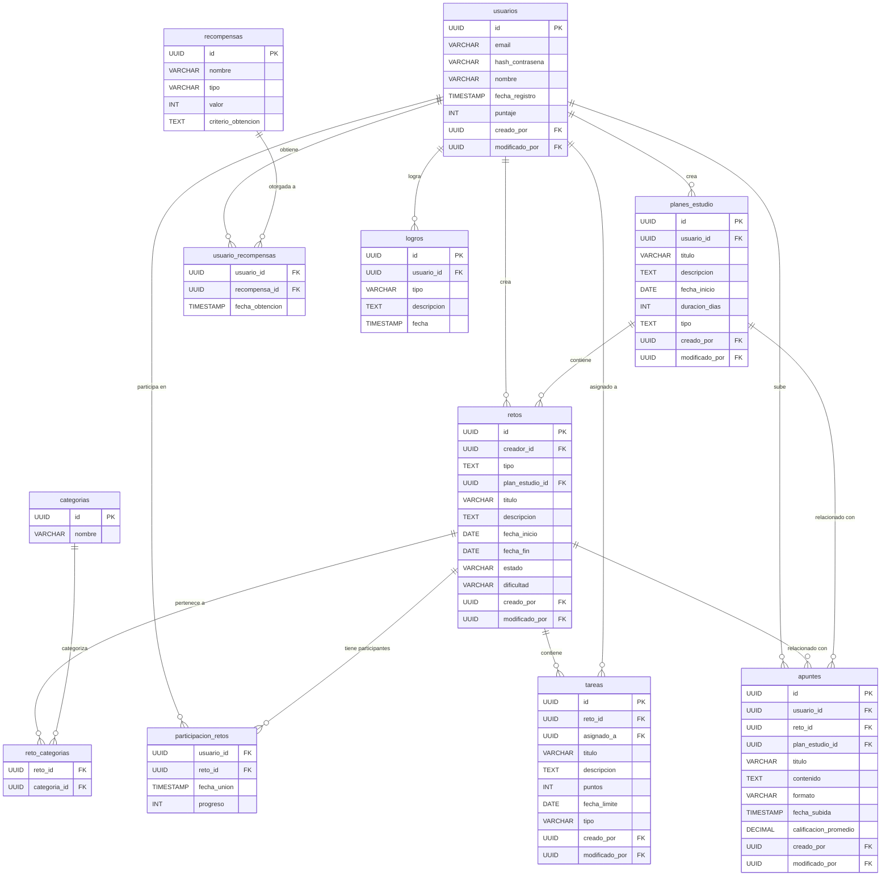

```mermaid
erDiagram
    usuarios {
        UUID id PK
        VARCHAR email
        VARCHAR hash_contrasena
        VARCHAR nombre
        TIMESTAMP fecha_registro
        INT puntaje
        UUID creado_por FK
        UUID modificado_por FK
    }

    categorias {
        UUID id PK
        VARCHAR nombre
    }

    planes_estudio {
        UUID id PK
        UUID usuario_id FK
        VARCHAR titulo
        TEXT descripcion
        DATE fecha_inicio
        INT duracion_dias
        TEXT tipo 
        UUID creado_por FK
        UUID modificado_por FK
    }

    retos {
        UUID id PK
        UUID creador_id FK
        TEXT tipo
        UUID plan_estudio_id FK
        VARCHAR titulo
        TEXT descripcion
        DATE fecha_inicio
        DATE fecha_fin
        VARCHAR estado
        VARCHAR dificultad
        UUID creado_por FK
        UUID modificado_por FK
    }

    reto_categorias {
        UUID reto_id FK
        UUID categoria_id FK
    }

    participacion_retos {
        UUID usuario_id FK
        UUID reto_id FK
        TIMESTAMP fecha_union
        INT progreso
    }

    tareas {
        UUID id PK
        UUID reto_id FK
        UUID asignado_a FK
        VARCHAR titulo
        TEXT descripcion
        INT puntos
        DATE fecha_limite
        VARCHAR tipo
        UUID creado_por FK
        UUID modificado_por FK
    }

    apuntes {
        UUID id PK
        UUID usuario_id FK
        UUID reto_id FK
        UUID plan_estudio_id FK
        VARCHAR titulo
        TEXT contenido
        VARCHAR formato
        TIMESTAMP fecha_subida
        DECIMAL calificacion_promedio
        UUID creado_por FK
        UUID modificado_por FK
    }

    recompensas {
        UUID id PK
        VARCHAR nombre
        VARCHAR tipo
        INT valor
        TEXT criterio_obtencion
    }

    usuario_recompensas {
        UUID usuario_id FK
        UUID recompensa_id FK
        TIMESTAMP fecha_obtencion
    }

    logros {
        UUID id PK
        UUID usuario_id FK
        VARCHAR tipo
        TEXT descripcion
        TIMESTAMP fecha
    }

    usuarios ||--o{ planes_estudio : "crea"
    usuarios ||--o{ retos : "crea"
    planes_estudio ||--o{ retos : "contiene"
    retos ||--o{ reto_categorias : "pertenece a"
    categorias ||--o{ reto_categorias : "categoriza"
    usuarios ||--o{ participacion_retos : "participa en"
    retos ||--o{ participacion_retos : "tiene participantes"
    retos ||--o{ tareas : "contiene"
    usuarios ||--o{ tareas : "asignado a"
    usuarios ||--o{ apuntes : "sube"
    retos ||--o{ apuntes : "relacionado con"
    planes_estudio ||--o{ apuntes : "relacionado con"
    usuarios ||--o{ usuario_recompensas : "obtiene"
    recompensas ||--o{ usuario_recompensas : "otorgada a"
    usuarios ||--o{ logros : "logra"
```